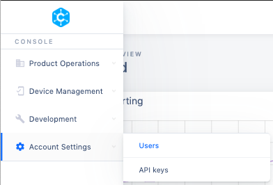
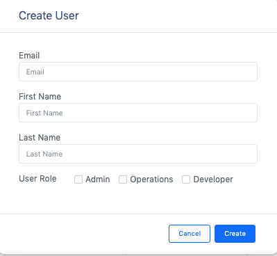

# Adding new Users and User Roles

To add new users to your account, you can click  **Account Settings**  and then click on  **Users**  to get to User Management page.

On the  **User Management page**, you can see all the registered users in your account along with their roles. You also edit the roles for each user. Each user can have one or more of the following roles:

1. Admin role allows a user to add other users to the account

2. Operations role allows a user to add Device Types and Devices to an account

3. Developer role allows a user to log in to the console and see the data

To add a new user, click  **Create User**  button on User Management page and fill in the details in the form as shown below.

