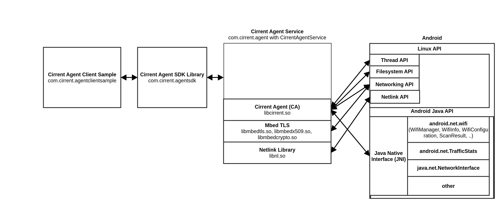

# Cirrent Agent on Android

# Overview

The Cirrent Agent is compatible with **Android 6.0 (API level 23) and above**. The Cirrent Agent is delivered as a tarball comprised of:

-   .apk  file for easy installation of the Cirrent Agent.
    
-   Helper scripts for configuring the Cirrent Agent (requires  adb).
    
-   A sample client written in Java that uses the Cirrent Agent API.
    

The Cirrent Agent runs as a background service. It is recommended to run it as a system/persistent service to avoid being killed due to Android's memory management features. The Cirrent Agent is pre-compiled and encapsulated in the  CirrentAgentService  for easy installation on Android devices.

Features include:

-   IoT Network Intelligence (INI)
    
-   Connection Manager (CM)
    

Dependencies vary by features.

# Components

