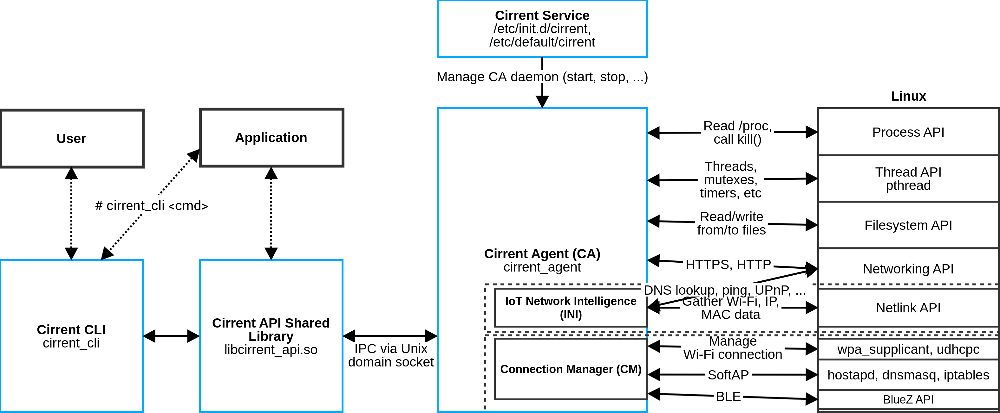

# Cirrent Agent on Linux

# Overview

The Cirrent Agent is compatible with  **Linux 2.2 and above**. The Cirrent Agent is delivered as a tarball comprised of:

-   Pre-compiled binaries compatible with your device’s architecture (armhf, x86, etc)
    
-   All necessary configuration files
    
-   Scripts for managing the Cirrent Agent
    
-   Shared libraries for working with the Cirrent Agent
    

Features include:

-   IoT Network Intelligence (INI)
    
-   Connection Manager (CM)
    

Dependencies vary by features. Source code available with Software License Agreement (SLA).

# Components

