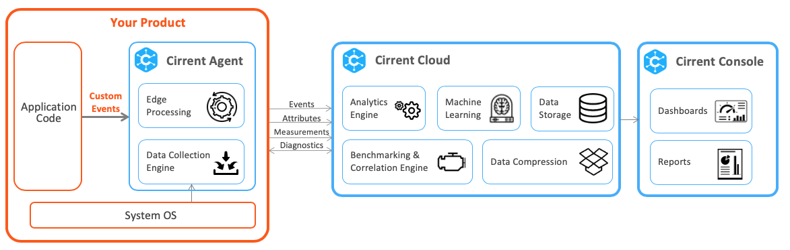

# INI Benefits and Features
IoT Network Intelligence (INI) helps you monitor your fleet of connected devices. We developed INI as a purpose built tool for Wi-Fi connected products to help you identify issues and resolve them faster. INI’s unique strength comes from a combination of embedded agent and cloud logic to bring insights for your connected devices.

## Network Performance Monitoring:

**Benefits:**

1.  Proactive monitoring of full fleet in a scalable and cost effective way
2.  Identify connectivity issues and understand how many users are impacted by an issue
3.  Accelerate debug process by running remote diagnostics for devices in the field
4.  Accelerate launch of new product or release of new firmware

**Features:**

1.  Understand broad trends for your entire fleet
2.  Benchmark performance of different connected products (eg: different SKUs or models, different ODMs, etc) against Wi-Fi environment
3.  Isolate failure using 20+  [Events](ini-events). These events help you determine if the failure is in the Network stack, or from device to Router, or Router to ISP, or Device to Cloud, or if it’s caused by RF conditions
4.  Use Measurements to understand user's Wi-Fi environment. Eg: If device is too far from the router or if there is interference
5.  Quantify how many customers are impacted by each issue
6.  Find correlation between Events (eg: Wi-Fi Not Associated) and  [Attributes](ini-attributes)  (eg: routers)
7.  Router make and model identification
8.  ISP and location identification
9.  Ability to add Custom Attributes (eg: firmware version, manufacturing lot number, ODM, etc) to understand correlation
10.  Identification of problematic routers
11.  Drill down from whole fleet view down to single device. Identify sub-population of devices with issues
12.  Compare performance of a single device to the performance of sub-populations that the device belongs to
13.  Diagnostics to get additional information from impacted devices in the field (syslogs, network_profile, CY Wi-Fi diagnostics)
14.  INI agent has edge processing to ensure that we keep cloud costs to reasonable levels while scaling
15.  Low bandwidth overhead so that the device operation is not impacted (less than 100KB of data uploaded to the cloud per day)
16.  Measure performance during alpha or beta tests instead of relying on feedback from alpha / beta users

## Application Performance Monitoring

**Benefits:**

1.  Monitor application level issues with your new product or new firmware release
2.  Understand how many users are impacted by an application issue
3.  Verify that issue has been resolved after deploying a fix to the field
4.  Accelerate launch of new product or release of new firmware

**Features:**

1.  Monitor application level issues such as process crashes using Custom Events
2.  Monitor resource usages such as high CPU usage, high memory usage, high space
3.  Monitor crashes, reboots and user initiated reboots
4.  Parse logs for keywords (eg: Warning, Error) and view those as Custom Events in the console
5.  Monitor fleet performance after fix has been deployed
6.  Measure performance during alpha or beta tests instead of relying on feedback from alpha / beta users
7.  Use Custom Measurements to monitor system / application performance

## How does INI work?

The Cirrent Agent is embedded software that goes on your product. It collects some data out of the box and you can pass more data using Custom Events, Custom Measurements and Custom Attributes. The Cirrent agent does edge processing and sends the data to Cirrent Cloud.

The Cirrent cloud processes the data using Analytics engine, Benchmarking & Correlation engine, and machine learning. The Cirrent cloud also stores and compresses the data. The Cirrent console shows insights on your products using dashboards and reports.

