# INI Console User Guide
Ready to get started?

At this point, you’ve set up your device to be able to run Cirrent’s IoT Network Intelligence (INI). This guide is intended for Engineers, Product Managers and Customer Support Agents who use the console to get insights on their Wi-Fi connected products. This guide will walk you through how you can use the console to monitor performance of your fleet, to get insights at both the aggregate-level and on a single device, and to diagnose problems with products in the field.

# Login

First thing you’re going to need to do is login. Enter your email and password.

# Dashboard

The first screen that you will see when you login is your dashboard.

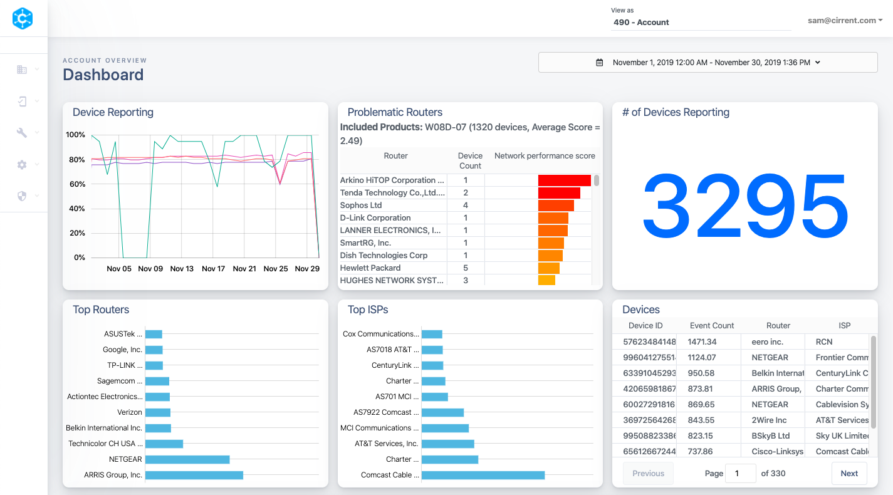

On the top right, you can choose the time period that you’d like to view.

Then, starting at the top left corner,  you will see various tiles holding data, charts, etc. Below are descriptions of each tile and what they mean for your products.

For a deeper dive into any of the charts, just click on a point within the box and it will take you to another page with more details.

## Device Reporting

This chart shows number of devices that are reporting each day.

## Problematic Routers

This chart shows on which routers your products are experiencing the most issues.

## # of Devices Reporting

This chart shows number of devices that have reported in the time period.

## Top Routers

This chart shows which routers are most popular for your fleet of devices within the time period.

## Top ISPs

This chart shows a ranking of which Internet Service Providers most of your devices are on during the chosen time period.

## Devices

List of unique devices sorted by number of events that device has experienced in the time period.

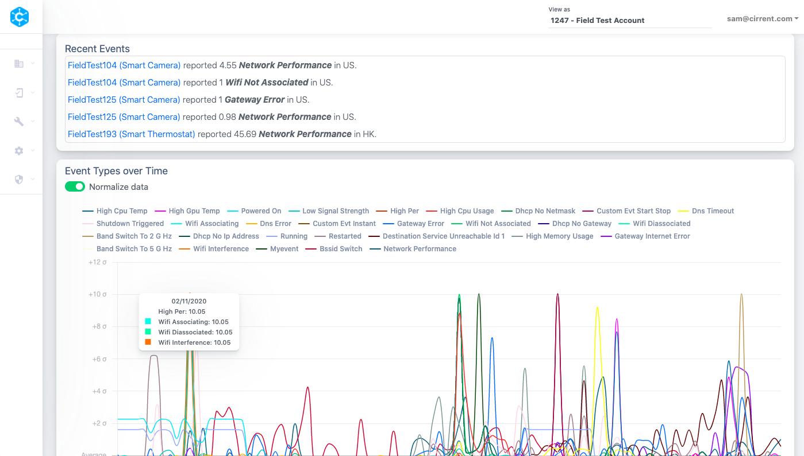

## Recent Events

This chart shows recent events occurring on any of your devices.

## Event Types over Time

Charts metrics over time period. This data can be in event counts, but is defaulted to normalized view. Toggle the Normalize data button to see event counts.

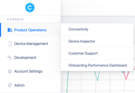

On the left side of your screen, you will see the navigation. In this section, we will focus on Product Operations tools.

# Connectivity

The Connectivity dashboards will show multiple charts- one on each tab. The Connectivity dashboards gives you an aggregate view of your fleet. You can also check relative performance across different sub-sets of the fleet.

## Over Time

This chart shows metrics over time period. Toggling Normalize data allows you to see the metric counts. You can filter by metric type (including network performance events and custom events). You can also filter by various attributes. For example, if you only want to look at your devices in the United States, you can filter by Country = US.

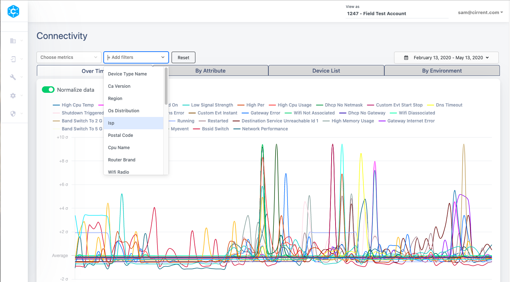

## By Attribute

This view shows metrics (issues), ranked by count from most issues to least, by attribute. You’re able to select a metric to view and filter by any attribute. You’re also able to customize what columns you’d like to see.

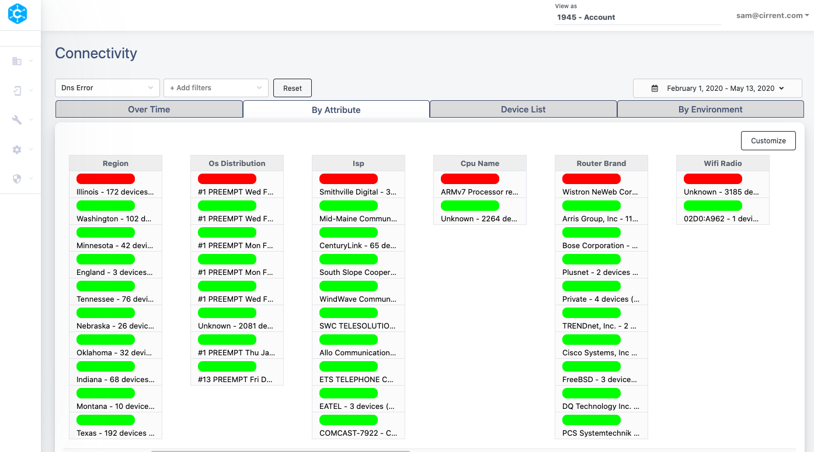

## Device List

This is a list of unique devices that have experienced the selected metric. In the screen below, Low Signal Strength is the metric. You’re also able to filter by any attribute, change the time period and customize the columns. The list defaults to a ranking from highest metric value to lowest.

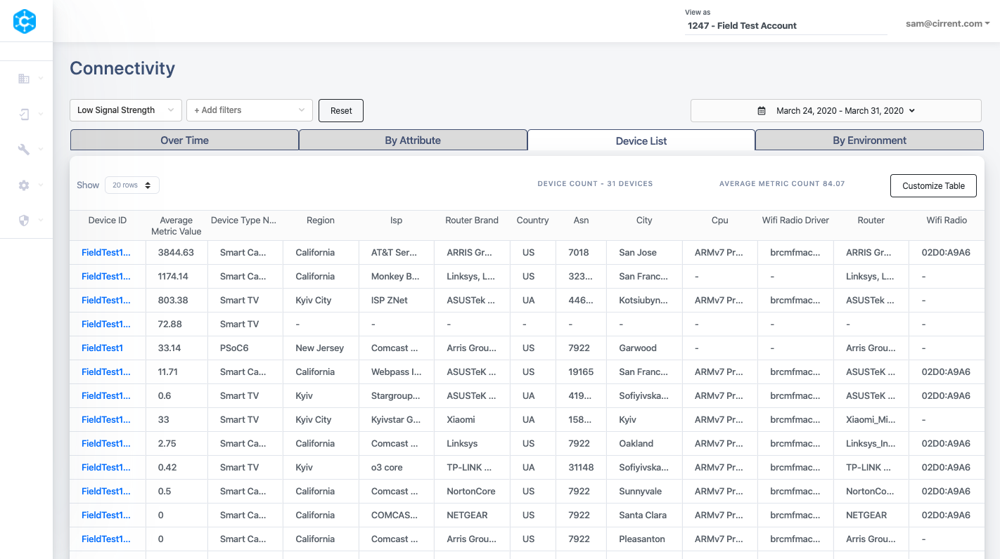

## By Environment

This is a benchmarking tool. To get the most out of the dashboard, click the settings button and choose what metric you’d like to view. Choose environment - from ISP, router, country or a combination of those. Then choose any attribute or attribute combination to compare against any other attribute or combination.

Once you apply the settings that you have chosen, the benchmark chart will populate. It will default to ranking from worst to best, but you can click on any of the columns and it will rank based on the column. For example, if you want to rank by number of devices in that environment, click “device Count.”

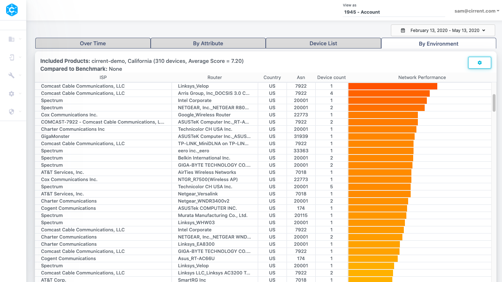

# Device Inspector

The Device Inspector dashboards give you the view of a single device.

## Network

This page shows the network performance of a single device. In the top right side, input the device ID. Choose the time period to explore.

The  **Last Known State**  will show environmental information for the device including the network operator and the router make and model that the device is connected to. It will also show the SSID, BSSID, signal strength, frequency and channel width.

**Metrics Summary** table allows you to compare metrics for this single device against other devices in your fleet or a subset of the other devices in your fleet. Under the Last 30 days average, there is a dropdown menu where you can choose either from a list of attributes including device type, router, region, ISP, and more.

This is useful to understand if this device is performing better, worse or average compared to other like devices or devices in similar environments. For example, perhaps you’d like to compare this device against other devices with the same device type, or connected to the same router brand. This will help you nail down root cause of issues.

**Metrics Over Time**  shows metrics for that particular device over the selected time period.

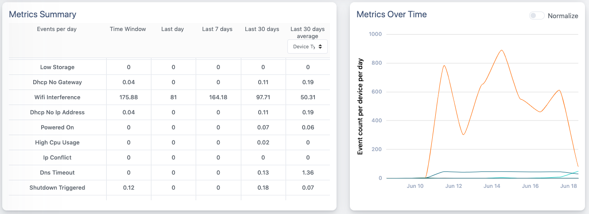

**Connectivity Values**  shows the measurements collected by the Cirrent Agent for the device.

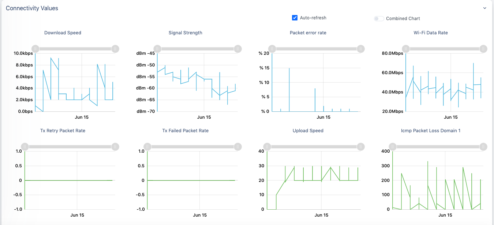

**Wi-Fi Scans**  shows the list of Wi-Fi networks around the device. This is useful to to check if there is an issue related to mesh extenders, or if there are too many networks on a particular Wi-Fi channel

**Diagnostics** will allow you to both run a diagnostic on this particular device and view diagnostics that you have run as well as their status and results.

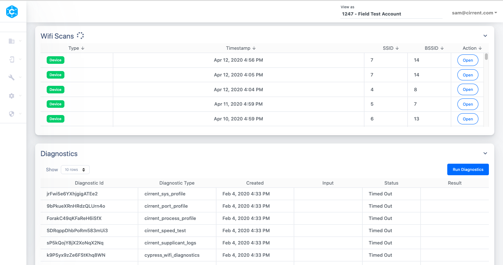

## Diagnostics

From this tab, you are able to run diagnostics on a single device. You will see the status of the diagnostic test on the chart table. Once the diagnostic has run, you will be able to click on the results to see more information.

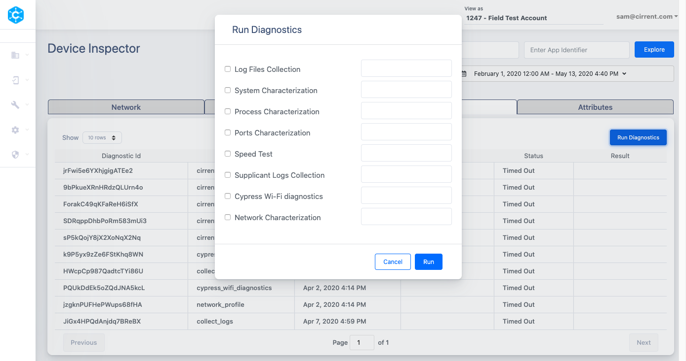

# Device Management

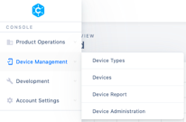

On the left side of your screen, you will see the navigation. In this section, we will focus on Device Management. Only Console Users with Operations privilege have access to Device Management.

## Device Types

From this tab, you are able to add, edit or delete Device Types. We suggest using different device types for different products or SKUs so that you can compare performance between different products in the field.

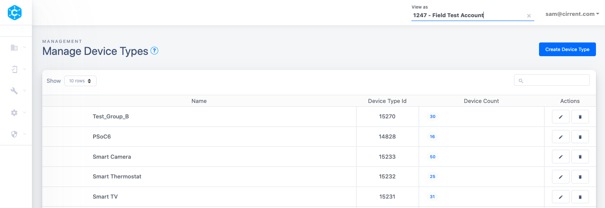

## Devices

From this tab, you are able to register devices to your account. More details on registering devices is available here:  [registering devices with Cirrent](registering-devices-with-cirrent)

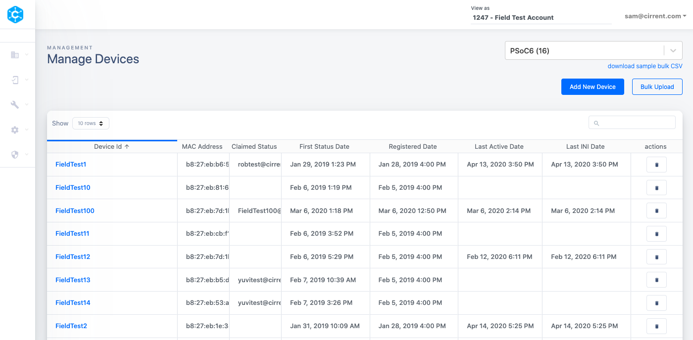
