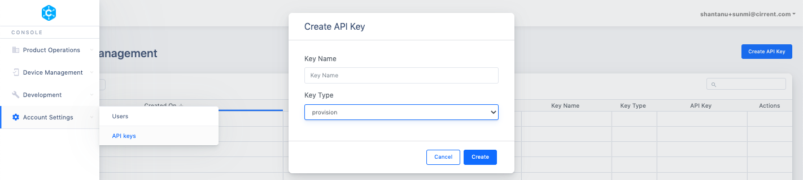

# Starting CA using temporary credentials

If you do not have a unique device id and secret that you can provision during manufacturing, Cirrent supports dynamic provisioning of devices, where you can use a provisioning key that is shared across many devices. Cirrent's service uses this provisioning key and the device id to generate a temporary shared secret unique to the device, and uses that to log into ZipKey hotspots and the Cirrent cloud. On the first connection, the device is then issued a more permanent device id and shared secret.

Here is how you start the CA to use the temporary credentials:

1.  Make sure you have a Provisioning Key, Provisioning Secret (see screen shot below on how to create these), device type id[(see in Console](https://console.cirrent.com/device-types)), your account ID ([see in Console](https://console.cirrent.com/edit-user-profile)) and a unique device identifier for your device(could be a serial number, MAC address or any other unique identifier).



2. Run the cirrent_agent on the device passing in the account_id, device_type_id, provisioning_key, provisioning_secret and unique device identifier(eg: serial_number). The following table describes the arguments that needs to be passed to Cirrent Agent on Linux and Android platform while using Temporary Credentials.

|  | Account ID | Device Type ID | Provisioning Key | Provisioning Secret | Unique Device Identifier |
| :----------: | :----------: | :-------------------: | :------------------------: | :-----------------------------: | :-----------------------------: |
Linux| -A | -D | -K |-S |-U | 
Android | acc_id | device_type_id | prov_key | prov_secret | serial_number

-   `For Linux:`
```
sudo ./cirrent_agent -c /etc/cirrent/cirrent_agent.conf -A 0000 -D 0000 -K abc -S abc -U abc
```
-   `For Android(using adb shell):`
```
am startservice -n com.cirrent.agent/.CirrentAgentService -e acc_id 0000 -e device_type_id 0000 -e prov_key abc -e prov_secret abc -e serial_number abc
```
When the CA starts, it will use the temporary credentials to log in to ZipKey network. As soon as the CA can reach the cloud, the CA will get new permanent credentials for the device. You can check that this happened correctly by looking at the  [Management Center](https://go.cirrent.com/management/devices)  where you should see a new device id, using the unique device identifier for your device.
