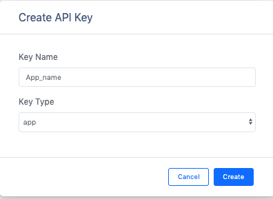

# Mobile App Intelligence User Guide


## 1. Introduction:

Mobile App Intelligence (MAI) product consists of two parts: a. Mobile App SDK that is installed in connected product mobile apps, and b. Cirrent console that displays the analytics data collected from the app. By including Mobile App SDK in their apps, customers get access to dashboards and analytics in the Cirrent Console.

MAI helps product companies understand the Wi-Fi onboarding experience for their users and the problems app users are facing in the field. Connected product companies can use this data to understand onboarding issues with their apps, fix these issues and measure the impact. By iterating through this process, connected product companies can improve Wi-Fi onboarding success rate for their products, reduce customer call volumes and improve app ratings.

2. Benefits of using MAI:

The Analytics in Cirrent Console enable connected product companies to:

1.  Get quick time to value
2.  Measure the  onboarding duration and success rate for onboarding
3.  Capture data on Attributes such as router type, ISP, phone OS / model. Ability to add Custom Attributes (eg: App Version)
4.  Aggregate views of all the apps in the fleet showing the sensitivity of onboarding issues with various Attributes
5.  Ability to drill down from aggregate view to a single onboarding instance to find issues related to Wi-Fi onboarding
6.  Solve issues reported through Customer Support calls

## 3. Terms:

AppID: Each app instance has unique AppID that is provided by customer

OnboardingID: Each onboarding attempt is assigned unique OnboardingID by Cirrent SDK

DeviceID: unique ID for each connected product

## 4. Sample App and SDK repos

**App repos :**

Android [https://github.com/Cirrent/ZipKey-Android-App](https://github.com/Cirrent/ZipKey-Android-App)

iOS [https://github.com/Cirrent/ZipKey-iOS-App](https://github.com/Cirrent/ZipKey-iOS-App)

**SDK(binaries) repos:**

Android [https://github.com/Cirrent/ZipKey-Android-SDK](https://github.com/Cirrent/ZipKey-Android-SDK)

iOS [https://github.com/Cirrent/ZipKey-iOS-SDK](https://github.com/Cirrent/ZipKey-iOS-SDK)

## 5. App permissions

You will need to ask the user for the following App permissions for Cirrent SDK to be able to collect the data needed for Mobile App Intelligence:

**iOS:**

1.  Location;
2.  Local Network(iOS 14).

**Android:**

Location

## 6. Using Cirrent MAI within your app

## 6a. Create Analytics JWT

The connected product mobile app will use a JSON web token (JWT) to confirm its scope of control when it calls the Cirrent cloud. The App API Key and Secret are generated using Cirrent Console using link  [https://console.cirrent.com/api-keys](https://console.cirrent.com/api-keys). Please click “Create API Key” button and choose key type as “app” as shown below.



Using the App API Key and Secret, you will need to generate  [Analytics token](analytics-token-generation).

Please use one of these options to generate analytics JWT token:

1. Generate the token using your cloud and sign with App API Secret.

OR

2. Generate the analytics JWT token using the SDK.

|  Function | Description |
| :---------- | :--------------------------|
createToken(_int expiresIn,_<br>_String accountId,_<br>_String appId,_<br>_String appKey,_<br>_String appSecret_) | **@param** **expiresIn** _Token lifetime in seconds._<br>**@param** **accountId** _Account Id._<br>**@param** **appId** _App Id._<br>**@param** **appKey** _App API key._<br>**@param** **appSecret** _App API secret._<br>**@return** _The output of this method will be “{appKey}::{JwtToken}”._

## 6b. Add SDK Functions to the app

It is useful to look at the SDK functions as two separate categories:

**I. Init Function**

It is possible to get started within minutes by using only the Init Function. Using just the Init function provides a way to get quick time to value from Cirrent Mobile SDK. Note that any communication between the app and Cirrent cloud needs an analytics JWT token.

_Android:_


|  Function | Description |
| :---------- | :--------------------------|
init**(**_Context appContext,_<br><br>_String analyticsToken,_<br><br>_MAICallback callback__)_ | Starts the SDK <br>Captures and sends the phone information (phone model, OS), and the Wi-Fi information used to identify router, ISP, SSID for the network, etc<br><br>**@param** **appContext** _Application Context_<br>**@param** **analyticsToken** _Analytics token._<br>**@param** **callback** _MAICallback_

_iOS:_


|  Function | Description |
| :---------- | :--------------------------|
initialize(_analyticsToken: String,_<br><br>_delegate: <br>MAICallback_) | Starts the SDK<br>Captures and sends the phone information (phone model, OS), and the Wi-Fi information used to identify router, ISP, SSID for the network, etc<br><br>**@param** **analyticsToken** _Analytics token._<br>**@param** **delegate** _MAICallback_

**Information about  _MAICallback_:**

Init and onboarding related functions have a  _MAICallback parameter._

MAI Callback is an interface which you can implement once(e.g in your base class) and just reuse. It has the following methods:


|  Function | Description |
| :---------- | :--------------------------|
onTokenInvalid(_Retrier retrier_) | This function is called when token is invalid. <br><br>**@param** **retrier** _Allows you to pass a new token and resend collected data using Retrier.retry(String token)._<br><br>_In case of Retrier.retry(String)_  _failure MAICallback.onFailed(OnboardingAnalyticsError)_  _will be called._
onFailed**(**_OnboardingAnalyticsError e__)_ | Will be called when: <br><br>- Retrier.retry(String)  is failed to resend data using a new token;<br><br>- the conditions for calling the method are not met (e.g. attempt to call enterStep(String, Context, MAICallback)  before startOnboarding(Context, int, MAICallback)  etc.);<br><br>- data hasn't been sent due to some issues on the cloud side.<br><br>**@param** **e** _An object that contains information about failure causes._

**II. Onboarding related functions**

These functions help capture data related to particular onboarding. A single try of one app instance onboarding one Wi-Fi connected device is considered to be a unique OnboardingID. It is essential to use start_onboarding and end_onboarding functions to identify the start and end of a unique OnboardingID.

The SDK gives the app developers flexibility to decide on which steps in the app to collect data. App developers can also annotate moving from one step to the next with reason codes.

_Android:_


|  Function | Description |
| :---------- | :--------------------------|
startOnboarding(Context appContext, <br> <br>MAICallback callback_)_ |Required method that tells the cloud that onboarding has been started. Also creates a unique onboarding id and stores it for subsequent calls. <br> <br>**@param** **appContext** _Application Context._ <br>**@param** **callback** _MAICallback_
|startOnboarding(Context appContext, <br> int onboardingSessionTimeout, <br>MAICallback callback) | Same as the function above, but in this case it has an additional  _“__onboardingSessionTimeout__”_ parameter. <br> <br>**@param** **appContext** _Application Context._ <br> **@param** **onboardingSessionTimeout** _(in seconds)_  _if the time gap between onboarding steps > this value then onboarding duration timers will be paused till the next step is performed._ <br>_By default this value = 15 minutes._ <br>**@param** **callback** _MAICallback_
|enterStep(String thisStepName, <br>Context appContext, <br>MAICallback callback) | Sends to the cloud information about previous(if it occurred) and current step. <br> <br>**@param** **thisStepName** _Current step name._ <br>**@param** **appContext** _Application Context._ <br>**@param** **callback** _MAICallback_
| enterStep(String thisStepName, <br>String reason, <br>Context appContext, <br>MAICallback callback) | Sends to the cloud information about previous(if it occurred), current step. <br> <br>and the reason for why user moved from previous step to current step. <br> <br>**@param** **thisStepName** _Current step name._ <br>**@param** **reason** _Will be added to the previous step name(e.g. “{previousStepName}_{reason}”)._ <br>**@param** **appContext** _Application Context._ <br>**@param** **callback** _MAICallback_
| endOnboarding(Context appContext, <br>MAICallback callback_)_ | Close out the onboarding id. Tells the cloud that onboarding has been ended. <br> <br>**@param** **appContext** _Application Context._ <br>**@param** **callback** _MAICallback_
| endOnboarding(String reason, <br> <br>Context appContext, <br>MAICallback callback) | Same as the function above, but in this case it has an additional  _“__reason__”_ parameter. Can be used to report a "_reason_" of an unsuccessful on-boarding. <br> <br>Also you can call this method to "end" a failed onboarding without setting an onboarding type. <br> <br>In this case MAICallback.onFailed(OnboardingAnalyticsError) will not be called. <br> <br>**@param** **reason** _Will be added to the previous step name(e.g. “{previousStepName}_{reason}”)._ <br>**@param** **appContext** _Application Context._ <br>**@param** **callback** _MAICallback_
|setOnboardingDeviceInfo(String deviceId,<br>Context appContext,<br>MAICallback callback_)_ | Optional method that allows you to send a Device ID to the cloud.<br><br>**@param** **deviceId** _Currently on-boarding Device ID._<br>**@param** **appContext** _Application Context._<br>**@param** **callback** _MAICallback_
| setOnboardingDeviceInfo(String deviceId,<br>Map<String, String> additionalAttributes,<br>Context appContext,<br>MAICallback callback) | Same as the function above, but it also allows to add additional device attributes that will be sent along with the Device ID.<br><br>**@param** **deviceId** _Currently on-boarding Device ID._<br>**@param** **additionalAttributes** _Additional attributes._<br>**@param** **appContext** _Application Context._<br>**@param** **callback** _MAICallback_
| setOnboardingType(OnboardingType type,<br>Context appContext,<br>MAICallback callback_)_ | Required method that allows you to set an onboarding type.<br><br>Onboarding type should be set until  _endOnboarding(Context, MAICallback)_ is called. Types are SoftAP, BLE, ZipKey.<br><br>**@param** **type** _OnboardingType_<br>**@param** **appContext** _Application Context._<br>**@param** **callback** _MAICallback_
| setOnboardingType(String customType,<br>Context appContext,<br>MAICallback callback_)_ | Same as the function above, but in this case you can define a custom type.<br><br>For example, if you are using variants of SoftAP, you can compare performance between these variants using custom type.<br><br>**@param** **customType** _Custom on-boarding type._<br>**@param** **appContext** _Application Context._<br>**@param** **callback** _MAICallback_
| cancel() | Cancels all tasks.
| removeAllCollectedData(Context appContext) | Removes all cached collected data.

_iOS:_


|  Function | Description |
| :---------- | :--------------------------|
| startOnboarding(onboardingSessionTimeout: Int? = nil,<br><br> delegate: MAICallback) | Creates a unique OnboardingID and records the onboarding id and start time. Sends an event to the cloud.<br><br>**@param** **onboardingSessionTimeout** _(optional)_  _(in seconds)_  _if the time gap between onboarding steps > this value then onboarding duration timers will be paused till the next step is performed._<br>_By default this value = 15 minutes._<br>**@param** **delegate** _MAICallback_
|enterStep(thisStepName: String,<br><br>reason: String? = nil,<br><br>delegate: MAICallback) | Sends to the cloud information about previous(if it occurred), current step and the reason for why user moved from previous step to current step.<br><br>**@param** **thisStepName** _Current step name._<br>**@param** **reason** _(optional)_  _Will be added to the previous step name(e.g. “{previousStepName}_{reason}”)._<br>**@param** **delegate** _MAICallback_
| endOnboarding(reason: String? = nil,<br><br>delegate: MAICallback) | Close out the onboarding id. Tells the cloud that onboarding has been ended.<br><br>Can be used to report a "_reason_" of an unsuccessful on-boarding.<br><br>Also you can call this method to "end" a failed onboarding without setting an onboarding type.<br><br>In this case MAICallback.onFailed(OnboardingAnalyticsError) will not be called.<br><br>**@param** **reason** _(optional)_  _Will be added to the previous step name(e.g. “{previousStepName}_{reason}”)._<br>**@param** **delegate** _MAICallback_
| setOnboardingDeviceInfo(deviceId: String,<br>additionalAttributes: [String: String]? = nil,<br>delegate: MAICallback) | Optional method that allows you to send a Device ID to the cloud. It also allows to add additional device attributes that will be sent along with the Device ID.<br><br>**@param** **deviceId** _Currently on-boarding Device ID._<br>**@param** **additionalAttributes** _(optional)_  _Additional attributes._<br>**@param** **delegate** _MAICallback_
| setOnboardingType(type: OnboardingType,<br>delegate: MAICallback) | Required method that allows you to set an onboarding type.<br><br>Onboarding type should be set until  _endOnboarding(Context, MAICallback)_ is called.<br><br>Types are SoftAP, BLE, ZipKey.<br>**@param** **type** _OnboardingType_<br>**@param** **delegate** _MAICallback_
| setOnboardingType(customType: String,<br>delegate: MAICallback) | Same as the function above, but in this case you can define a custom type.<br><br>For example, if you are using variants of SoftAP, you can compare performance between these variants using custom type.<br>**@param** **customType** _Custom on-boarding type._<br>**@param** **delegate** _MAICallback_
| removeAllCollectedData() | Removes all cached collected data.
| cancelAllTasks() | Cancels all tasks.

## 7. Examples

1.  **Single line of code to collect Phone and Wi-Fi Environment details**

To get only environmental details such as Phone OS / model, app version and Wi-Fi environment details such as router, ISP, etc, you need to use only one function call

_Android:_
```
OnboardingAnalytics.init(applicationContext, analyticsToken, callback);
```
_iOS:_
```
OnboardingAnalytics.initialize(analyticsToken: token, delegate: callback)
```
2.  **Getting success rates and onboarding durations**

This example allows the app developers to understand how many onboarding attempts succeeded and what is the duration that a user spent to onboard a device to Wi-Fi. This allows developers to also see what was the last step that the user was on before abandoning in case of unsuccessful onboarding attempts.

_Java based example:_
```
OnboardingAnalytics.init(applicationContext, analyticsToken, callback);  
  
…  
  
OnboardingAnalytics.startOnboarding(applicationContext, callback);  
  
OnboardingAnalytics.setOnboardingType(OnboardingType.SOFTAP, applicationContext, callback);  
  
…  
  
OnboardingAnalytics.endOnboarding("SoftAP_web_Server_timeout_error", applicationContext, callback);
```
However, this example will not give details on what is the order of steps that the user takes before the end of onboarding.

3.  **Understand which steps cause users to abandon onboarding and why**

You will need to annotate the various onboarding steps with step names to understand where users abandon the process. Consider SoftAP onboarding process shown below where the user goes through a series of steps such as scanning for a device, connecting to SoftAP SSID, and then going to the step where the user enters private Wi-Fi network credentials. At this step, let’s say the user spent too much time entering his Wi-Fi password and gets a timeout error from the SoftAP connected device. As Cirrent SDK captures all steps and their duration all this information allows developers to understand the root cause of the issue. A similar approach can be used for onboarding steps for BLE.

_Java based example:_
```
OnboardingAnalytics.init(applicationContext, analyticsToken, callback);  
…  
OnboardingAnalytics.startOnboarding(applicationContext, callback);  
OnboardingAnalytics.setOnboardingType(OnboardingType.SOFTAP, applicationContext, callback);  
OnboardingAnalytics.enterStep("scanning_for_device", applicationContext, callback);  
OnboardingAnalytics.enterStep("connecting_to_device", applicationContext, callback);  
OnboardingAnalytics.enterStep("joined_soft_ap_ssid", applicationContext, callback);  
…  
OnboardingAnalytics.enterStep("enter_private_creds", applicationContext, callback);  
… {stepDuration > maxDuration}  
OnboardingAnalytics.endOnboarding("SoftAP_web_Server_timeout_error", applicationContext, callback);
```
4.  **Adding App Version using Custom Attributes**

Custom attributes enable an app developer to add specific pieces of data that might be relevant to understanding the onboarding performance. A typical example is App Version.

_Java based example:_
```
OnboardingAnalytics.setOnboardingDeviceInfo(  
 deviceId,  
 getAppVersion(),  
 applicationContext,  
 callback  
 );  
Map<String, String> getAppVersion() {  
 final Map<String, String> appVersion = new HashMap<>();  
 appVersion.put("app_version", BuildConfig.VERSION_NAME);  
 return appVersion;  
 }
 ```
