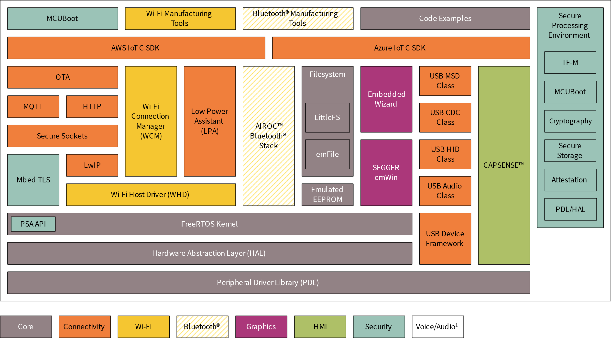
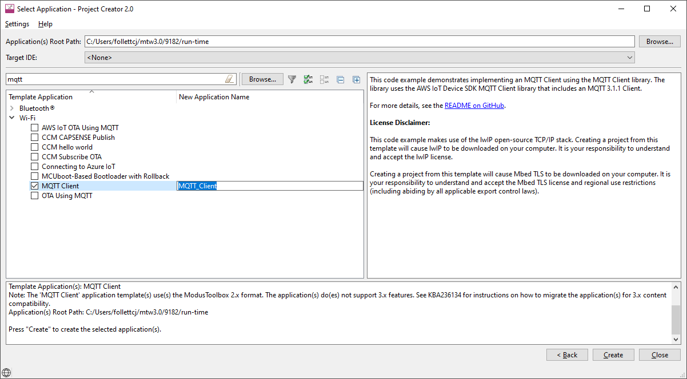
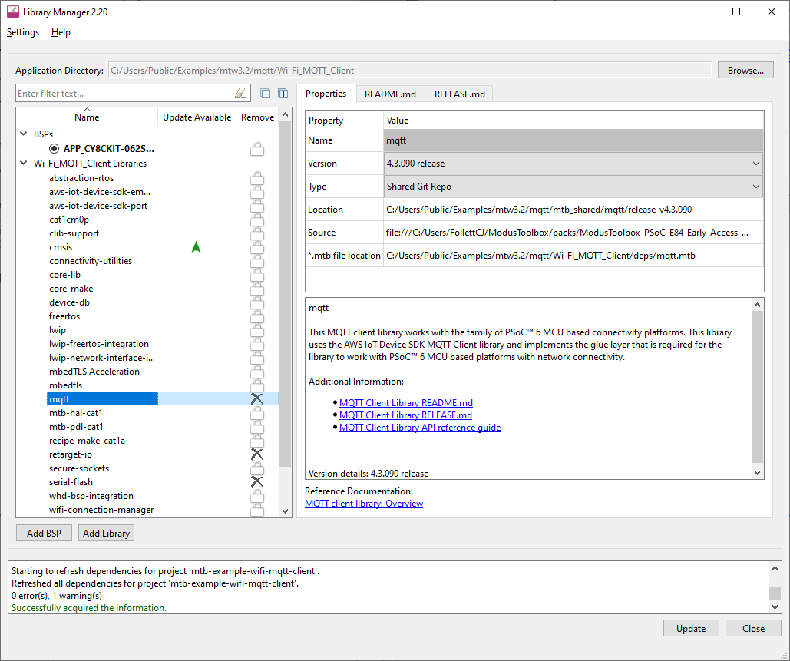
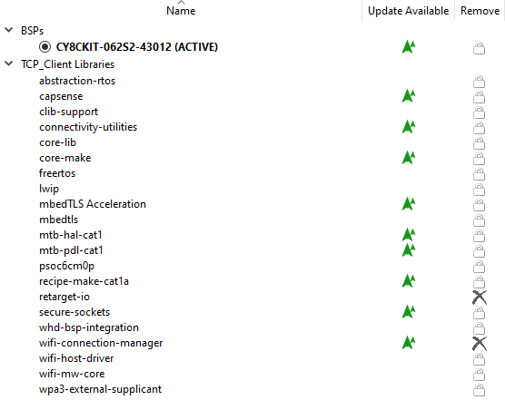
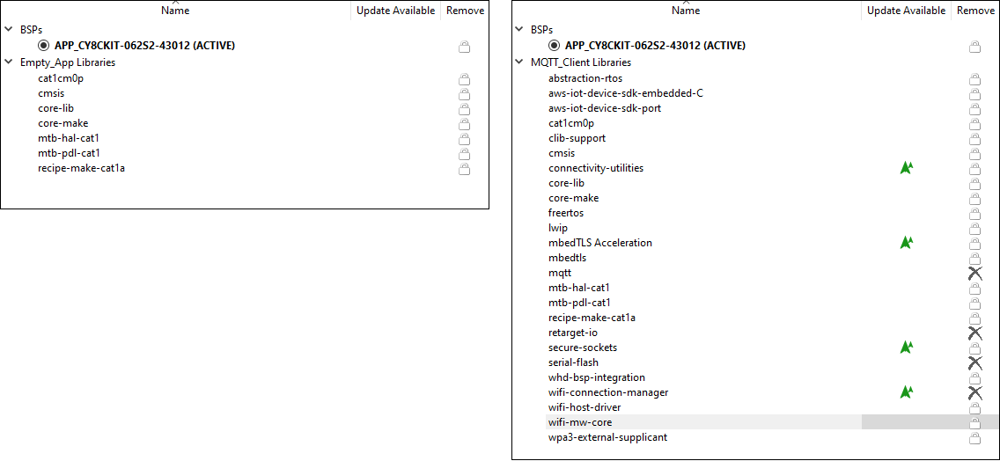
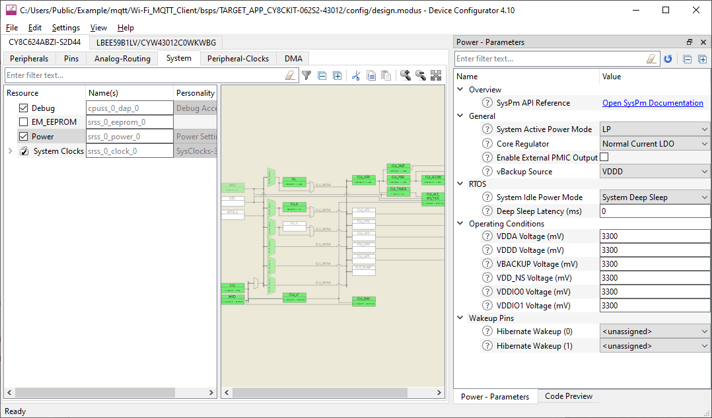

# Run-time software

The ModusToolbox™ run-time software helps you rapidly develop applications using Infineon BSPs. It provides features such as the Wi-Fi Connection Manager, a Secure Socket layer, support
for application layer cloud protocols, Bluetooth® Low Energy (LE) functionality, and Low Power Assist (LPA). The software currently supports TCP, MQTT, UDP, and HTTP/HTTPS client and server application layer protocols.

The ModusToolbox™ run-time software works together to help you easily get your IoT device connected to the cloud. Some of the libraries were written by us, while others use industry standard open source libraries. As you will see later in this document, these can be pulled into a ModusToolbox™ application using the Library Manager tool.

These libraries fit with various libraries as shown in the following diagram. See [Library dependencies](#library-dependencies) later in this document for how of these libraries are related.



<sup>1</sup> Voice/Audio is part of Machine Learning enablement; see [ModusToolbox Machine Learning](https://www.infineon.com/cms/en/design-support/tools/sdk/modustoolbox-software/modustoolbox-machine-learning/) for more details.

All libraries are available as GitHub repositories. These "repos" contain source files, readme files, and documentation such as an API reference. When you include a library in your ModusToolbox™ application, the 
repository is downloaded into a shared directory next to the application directory. See the [ModusToolbox™ tools package user guide](https://www.Infineon.com/ModusToolboxUserguide) for more details about an application's structure.

## Getting started

The easiest way to get started is with an example. We provide many code examples that allow you to experiment with various features. You can get the examples by creating a ModusToolbox™ application using the [Project Creator tool](https://www.Infineon.com/ModusToolboxProjectCreator).



You can see the various [code examples on our GitHub site](../Code-Examples-for-ModusToolbox-Software/README.md).

The examples include README.md files that guide you through the process to create and configure the application. If you're already familiar with ModusToolbox™ software, then create the TCP Client example using your normal process. If you're new to ModusToolbox™ software, refer to the quick start guide as needed.

### Library manager

The ModusToolbox™ Library Manager tool allows you to add and remove board support packages (BSPs) and libraries, as well as select specific versions of BSPs and libraries. Refer to the [Library Manager user guide](https://www.Infineon.com/ModusToolboxLibraryManager) for more details. As you can see in the following image, the MQTT Client code example application already includes several libraries.



After creating the application, open the Library Manager and notice that several of the libraries discussed in this guide are already present.



Then, create another application from an example, such as WLAN Low Power. Notice for this application that the LPA library is included.

Experiment with a few examples, and notice the differences in the libraries included, as well as various configuration options set for them. Obviously, review the code as well.

### Library dependencies

When you include certain libraries, there are dependencies on other libraries to ensure everything works correctly. As an example, the MQTT Client code example includes four .mtb files directly. After the application
has been created and processed, it contains numerous different libraries. See Adding libraries later in this section for more details.

Using the wifi -core- freertos - lwip-mbedtls library ensures you always have the essential Wi-Fi and networking libraries, plus good default configurations, in every cloud connected application you create.

### Adding libraries

As noted earlier, when the ModusToolbox™ build system encounters a .mtb file, it adds that library of code to the application. That library may contain additional .mtb files for dependent libraries. The ModusToolbox™
build system parses the .mtb files recursively so that all dependent libraries are added automatically. You do not need to know the dependencies.

The following images show the libraries included as part of an Empty PSOC™ 6 application before and after adding libraries.



When adding only a few libraries to the application, several other libraries are automatically included as well. The added libraries have their own dependency libraries, which in turn may have dependency libraries they depend upon. The same paradigm applies to various libraries that have dependencies. If you add a library that requires other libraries, they will be added automatically.

Dependencies are not necessarily bi-directional. While some libraries have dependencies, other libraries don’t -- even if they are a dependency of another library.

## Library configuration files
Some libraries provide configuration header file templates, such as the FreeRTOSConfig.h file. When adding a library to an application, copy the configuration file to the top-level application directory where you can edit it to customize the library. Even though there may be multiple files with the same name in an application, the ModusToolbox™ build system automatically picks the one at the top-level.

If you want to put the application-specific configuration files in a different location, you must specify the path to that directory (relative to the application's root directory) in the application's Makefile INCLUDE variable. The build system includes files in that path before it searches through the application's hierarchy.

The following are some examples of configuration files that you may need:

### Wi-Fi core configuration
The Wi-Fi middleware core library has been deprecated. Use the [porting guide](https://github.com/Infineon/lwip-network-interface-integration/blob/master/porting_guide.md) to migrate the application to use the lwIP
network interface integration library.

The following are template files to use for configuration:

- FreeRTOSConfig.h: Settings for FreeRTOS.

    Use this file as a template for FreeRTOS configuration instead of the one from the FreeRTOS library. It has some modifications specific to use with other ModusToolbox™ run-time software.

- mbedtls_user_config.h: Settings for Mbed TLS.

    In addition to copying this file, you must also configure the macro MBEDTLS_USER_CONFIG_FILE to specify the file's location and add the macro to the list of DEFINES in the application's Makefile. For example, if you put the file in the top level, you would include this in the Makefile:
    ```
    DEFINES+=MBEDTLS_USER_CONFIG_FILE='"mbedtls_user_config.h"'
    ```

    Note that many code examples use this format instead:
    ```
    MBEDTLSFLAGS = MBEDTLS_USER_CONFIG_FILE='"mbedtls_user_config.h"'
    DEFINES+=$(MBEDTLSFLAGS)
    ```

- lwipopts.h: Settings for lwIP. 

    Applications may choose to modify this file in order to optimize memory consumption based on the Wi-Fi characteristics of the application.

#### Optimizing smaller memory devices

Depending on your application or device size, you may need to reduce flash and RAM usage. The configuration files included with the lwIP and MbedTLS libraries provide various parameters to enable or disable features and optimize your application's size. For example, the MBEDTLS_SSL_SRV_C parameter enables code when the device is expected to function as a SSL/TLS server. If you don't need this feature, you can disable it to save flash:
    ```
    #undef MBEDTLS_SSL_SRV_C
    ```

### MQTT
The template file is in the mqtt/include subdirectory. See also the Quick Start in the library's [README.md file](https://github.com/Infineon/mqtt/README.md).
- core_mqtt_config.h: Settings for MQTT.

### OTA
The template file is in the ota-update/configs subdirectory. See also the library's [README.md file](https://github.com/Infineon/ota-update/README.md).
- cy_ota_config.h: Settings for OTA.

## Adding and configuring low power

The WLAN Low Power example is one of several that demonstrate the low power features in ModusToolbox™ software. Among the low power features are the power settings accessible in the Device Configurator.



There are settings for the PSOC™ 6 MCU and the connectivity combo device. For more details about how to configure low power, refer to the [LPA Guide](https://infineon.github.io/lpa/api_reference_manual/html/index.html).

## Adding and configuring Bluetooth®
As you have probably already discovered, there are several Bluetooth® examples as well. For example, the [Wi-Fi Onboarding Using Bluetooth® LE example](https://github.com/Infineon/mtb-example-btstack-freertos-wifi-onboarding) shows how to use Bluetooth® on the combo device to help connect the Wi-Fi device to an access point. It also shows how to enable low-power modes on both the Wi-Fi and Bluetooth® devices. For more details, refer to the example's README.md file.
